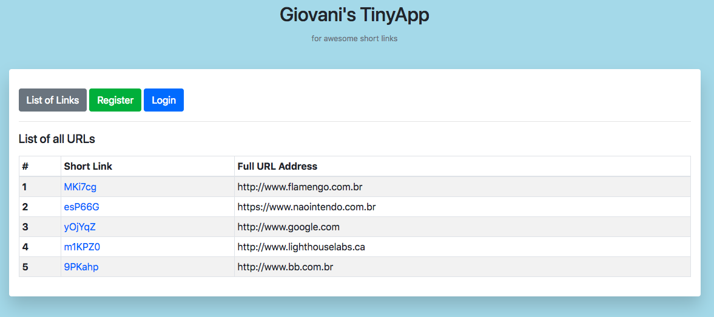
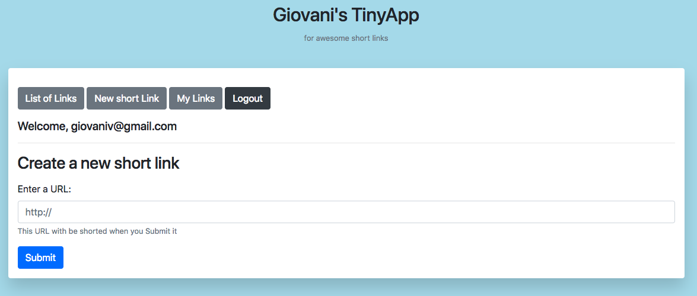
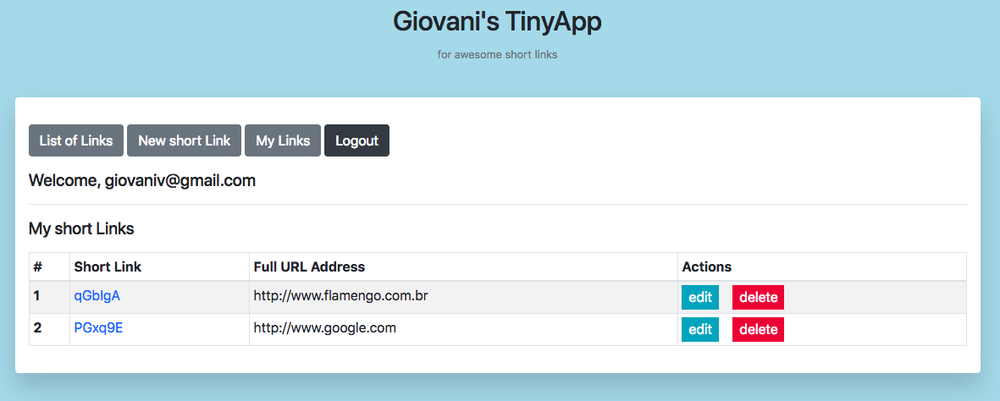

# Giovani's TinyApp Project

Full stack web application built with Node and Express that allows users to shorten URLs

## Final Product

## Dependencies

- Node.js
- Express
- EJS
- Bcryptjs
- body-parser
- cookie-session

## Getting Started

- Install all dependencies (using the `npm install` command for each of it).
- Run the development web server using the `node express_server.js` command.